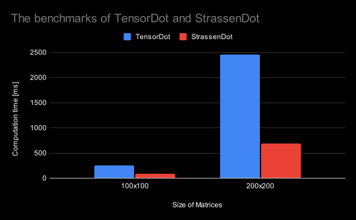

# Nunela

[](https://pkg.go.dev/github.com/bababax11/nunela)


## Overview

Nunela provides the linear algebra functionalities for the generic tensor module [Nune](https://github.com/vorduin/nune).

The name Nunela comes from Nune + LA (linear algebra).

This implements the multiplation of tensors with [Strassen's algorithm](https://en.wikipedia.org/wiki/Strassen_algorithm).


## Installation

To install Nunela, simply execute the following command:

```bash
go get github.com/bababax11/nunela
```

## Benchmarks

Concurrent Strassen algorithm `StrassenDot` is more than three times faster than general algorithm `TensorDot`:

  

To run benchmarks, execute the following command:

```bash
go test -bench . -benchmem
```

## Fuzzing

```bash
go test -fuzz <test name pattern> -fuzztime=10s
```

## Supported Go Versions

Only supports Go v1.18 and higher.


## License and Terms

Nunela is licensed under the
[Apache License, version 2.0](http://www.apache.org/licenses/LICENSE-2.0).
